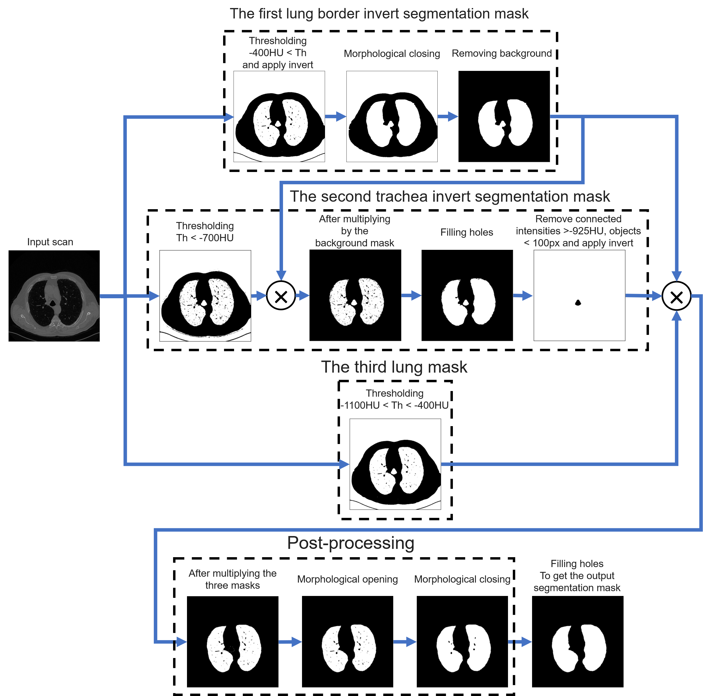
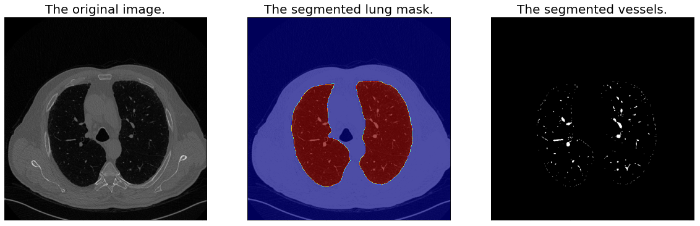

# Lungs and Vessels Segmentation for Chest CT

**Contributors**: Ahmed Gouda  

**Project Date**: 2021  

**Problem Statement**: This project presents a computer vision–based approach for lung and pulmonary vessel segmentation from 2D chest CT scans. Due to the absence of ground-truth annotations and the limited size of the dataset, traditional deep learning techniques were not applicable. Instead, a multi-stage 2D segmentation pipeline was developed using intensity thresholding, connected component analysis, and morphological operations. The proposed method generates three intermediate masks to isolate the lung region while excluding the background and trachea, followed by post-processing to refine lung boundaries and recover missed structures. Pulmonary vessels were subsequently segmented within the lung region based on Hounsfield Unit thresholds. Qualitative results demonstrate robust lung segmentation across challenging scans, with minor limitations in capturing large peripheral vessels. Additionally, geometric analysis was performed to compute lung area and vessel-to-lung area ratios, which were further analyzed using k-means clustering for unsupervised classification.  
**Dataset**: [*LIDC-IDRI*: Lung Image Database Consortium and Image Database Resource Initiative](https://www.cancerimagingarchive.net/collection/lidc-idri/)
 
## Lungs Segmentation Pipeline  

   
     
## Vessels Segmenatation  

    
## Abnormal Activation Map 
 
 

## References
● Armato et al. (2015) “LIDC‑IDRI | Data from The Lung Image Database Consortium (LIDC) and Image Database Resource Initiative (IDRI): A completed reference database of lung nodules on CT scans,” The Cancer Imaging Archive (TCIA). DOI:10.7937/K9/TCIA.2015.LO9QL9SX  
● Armato et al. (2011) “The Lung Image Database Consortium (LIDC) and Image Database Resource Initiative (IDRI): A completed reference database of lung nodules on CT scans,” Medical Physics, 38(2), pp. 915–931. DOI:10.1118/1.3528204  
● Gonzalez R. C., Woods R. E. (2018) "Digital Image Processing", 4th Edition, Pearson.
● Soille P. (2003) "Morphological Image Analysis: Principles and Applications", 2nd Edition, Springer.    
● Canny J. (1986) "A Computational Approach to Edge Detection", IEEE Transactions on Pattern Analysis and Machine Intelligence, 8-6, 679–698. DOI:10.1109/TPAMI.1986.4767851  
● Otsu N. (1979) "A Threshold Selection Method from Gray-Level Histograms", IEEE Transactions on Systems, Man, and Cybernetics, 9-1, 62–66. DOI:10.1109/TSMC.1979.4310076  
● MacQueen J. (1967) "Some Methods for Classification and Analysis of Multivariate Observations", Proceedings of the Fifth Berkeley Symposium on Mathematical Statistics and Probability, 1, 281–297.  
